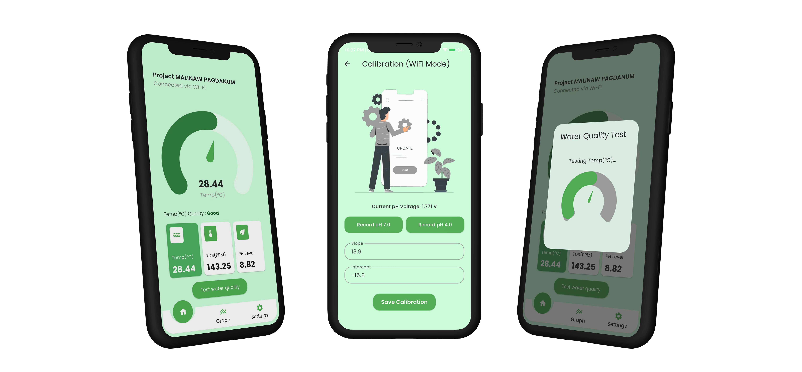

Overview

Project Malinaw Pagdanum is a Flutter-based mobile application designed to monitor water quality in real-time. The app receives data from IoT sensors connected to an ESP32 and stores it in Firebase Realtime Database for live monitoring and analysis.

The mobile app allows users to view:
- Water Temperature
- Turbidity
- pH Level
- ORP (Oxidation-Reduction Potential)
- TDS (Total Dissolved Solids)

All data updates in real-time through Firebase, providing an accessible and user-friendly interface for water quality monitoring.

Features

- Real-time display of water parameters
- Firebase Realtime Database integration
- Historical data logging
- Simple, clean, and responsive Flutter UI

Screenshots

Technologies Used
- Flutter (for mobile app development)
- Firebase Realtime Database (for live data storage and synchronization)
